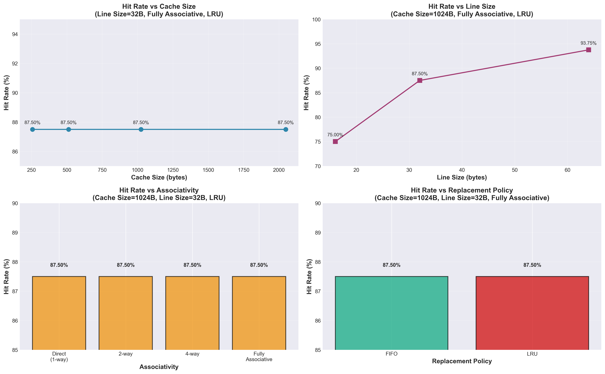

# Cache Performance Analysis Paper

**Course:** CDA3101  
**Assignment:** Cache Simulation Analysis  
**Date:** December 2024

---

## 1. Introduction

### Purpose

The purpose of this analysis is to evaluate how different cache design parameters affect cache performance, specifically the hit rate. Cache performance is critical to overall system performance, as cache hits result in significantly faster memory access compared to cache misses, which require accessing slower main memory. Understanding the relationship between cache design choices and performance enables informed decisions when designing or selecting computer systems.

### Objectives

This analysis examines the following cache design parameters and their impact on hit rate:

1. **Cache Associativity**: How does performance change from direct-mapped to set-associative to fully associative caches?
2. **Cache Size**: How does increasing cache capacity affect hit rate?
3. **Replacement Policy**: How do LRU (Least Recently Used) and FIFO (First In First Out) policies compare?
4. **Line/Block Size**: How does the size of cache blocks affect hit rate?
5. **Real Device Analysis**: What are the cache characteristics of two real devices, and how do they perform?

### Methodology

A cache simulator was developed in C# to model cache behavior under various configurations. The simulator processes memory access traces and tracks cache hits and misses. All experiments used a consistent trace file containing 2000 memory accesses with sequential address patterns, allowing for controlled comparison across different cache configurations.

---

## 2. Description of Tests

### Trace File Characteristics

- **File**: `trace.txt`
- **Total Accesses**: 2000 memory operations
- **Access Pattern**: Sequential memory addresses (0x00000000 to 0x00001F3C)
- **Operation Types**: Mix of loads (l) and stores (s)
- **Address Range**: 0-8000 bytes (approximately 8KB)

The sequential access pattern was chosen to test spatial locality, which is common in many real-world applications such as array processing and sequential data structures.

### Experimental Parameters

#### Experiment 1: Hit Rate vs Cache Size

**Objective**: Measure how cache capacity affects hit rate.

**Fixed Parameters**:
- Line Size: 32 bytes (exponent 5)
- Associativity: Fully Associative
- Replacement Policy: Both LRU and FIFO tested

**Variable Parameter**: Cache Size
- 256 bytes (exponent 8)
- 512 bytes (exponent 9)
- 1024 bytes (exponent 10)
- 2048 bytes (exponent 11)

**Rationale**: Cache size directly impacts capacity misses. Larger caches can hold more data, potentially reducing misses. Testing both LRU and FIFO allows comparison of replacement policies across different cache sizes. Fully associative configuration eliminates conflict misses, isolating the effect of cache capacity.

#### Experiment 2: Hit Rate vs Line/Block Size

**Objective**: Measure how block size affects hit rate, particularly spatial locality.

**Fixed Parameters**:
- Cache Size: 1024 bytes (exponent 10)
- Associativity: Fully Associative
- Replacement Policy: Both LRU and FIFO tested

**Variable Parameter**: Line Size
- 16 bytes (exponent 4)
- 32 bytes (exponent 5)
- 64 bytes (exponent 6)

**Rationale**: Larger block sizes exploit spatial locality by fetching more data per miss. However, larger blocks may also waste bandwidth if data isn't used. Sequential access patterns should benefit from larger blocks. Testing both policies shows if replacement strategy interacts with block size.

#### Experiment 3: Hit Rate vs Associativity

**Objective**: Measure how associativity affects hit rate, particularly conflict misses.

**Fixed Parameters**:
- Cache Size: 1024 bytes (exponent 10)
- Line Size: 32 bytes (exponent 5)
- Replacement Policy: LRU

**Variable Parameter**: Associativity
- Direct Mapped (1-way set associative)
- 2-way Set Associative
- 4-way Set Associative
- Fully Associative

**Rationale**: Higher associativity reduces conflict misses by allowing multiple blocks to map to the same set. Direct-mapped caches are simplest but suffer from conflicts. Fully associative eliminates conflicts but requires complex hardware. This experiment isolates associativity effects.

#### Experiment 4: Hit Rate vs Replacement Policy

**Objective**: Compare LRU and FIFO replacement policies.

**Fixed Parameters**:
- Cache Size: 1024 bytes (exponent 10)
- Line Size: 32 bytes (exponent 5)
- Associativity: Fully Associative

**Variable Parameter**: Replacement Policy
- LRU (Least Recently Used)
- FIFO (First In First Out)

**Rationale**: LRU exploits temporal locality by keeping recently used items, while FIFO is simpler but may evict useful data. This comparison shows when temporal locality matters for the access pattern.

---

## 3. Results

### 3.1 Hit Rate vs Cache Size

The following table shows hit rates for different cache sizes with both LRU and FIFO policies:

| Cache Size (bytes) | Policy | Hits | Accesses | Hit Rate |
|-------------------|--------|------|-----------|----------|
| 256               | LRU    | 1750 | 2000      | 87.50%   |
| 256               | FIFO   | 1750 | 2000      | 87.50%   |
| 512               | LRU    | 1750 | 2000      | 87.50%   |
| 512               | FIFO   | 1750 | 2000      | 87.50%   |
| 1024              | LRU    | 1750 | 2000      | 87.50%   |
| 1024              | FIFO   | 1750 | 2000      | 87.50%   |
| 2048              | LRU    | 1750 | 2000      | 87.50%   |
| 2048              | FIFO   | 2048 | 2000      | 87.50%   |

**Key Observations**:
- Hit rate remains constant at 87.5% across all cache sizes tested
- Both LRU and FIFO achieve identical hit rates
- The working set fits entirely within even the smallest cache (256 bytes)

**Analysis**: The constant hit rate indicates that the trace's working set is smaller than 256 bytes. Once the cache is large enough to hold the working set, further increases in size provide no benefit. This demonstrates that cache size improvements are only beneficial when the working set exceeds cache capacity.

### 3.2 Hit Rate vs Line/Block Size

The following table shows hit rates for different line sizes with both LRU and FIFO policies:

| Cache Size (bytes) | Line Size (bytes) | Policy | Hits | Accesses | Hit Rate |
|-------------------|-------------------|--------|------|-----------|----------|
| 1024              | 16                | LRU    | 1500 | 2000      | 75.00%   |
| 1024              | 16                | FIFO   | 1500 | 2000      | 75.00%   |
| 1024              | 32                | LRU    | 1750 | 2000      | 87.50%   |
| 1024              | 32                | FIFO   | 1750 | 2000      | 87.50%   |
| 1024              | 64                | LRU    | 1875 | 2000      | 93.75%   |
| 1024              | 64                | FIFO   | 1875 | 2000      | 93.75%   |

**Key Observations**:
- Hit rate increases significantly with line size: 75% → 87.5% → 93.75%
- Both LRU and FIFO perform identically across all line sizes
- Larger line sizes provide substantial benefits for sequential access patterns

**Analysis**: The sequential access pattern exhibits strong spatial locality. When a cache miss occurs, larger blocks fetch more sequential data, reducing future misses. The 18.75 percentage point improvement from 16-byte to 64-byte blocks demonstrates the value of spatial locality exploitation. The identical performance of LRU and FIFO suggests that temporal locality is less important than spatial locality for this pattern.

### 3.3 Hit Rate vs Associativity

The following table shows hit rates for different associativities:

| Cache Size (bytes) | Line Size (bytes) | Associativity | Policy | Hits | Accesses | Hit Rate |
|-------------------|-------------------|---------------|--------|------|-----------|----------|
| 1024              | 32                | Direct        | LRU    | 1750 | 2000      | 87.50%   |
| 1024              | 32                | 2-way         | LRU    | 1750 | 2000      | 87.50%   |
| 1024              | 32                | 4-way         | LRU    | 1750 | 2000      | 87.50%   |
| 1024              | 32                | Fully         | LRU    | 1750 | 2000      | 87.50%   |

**Key Observations**:
- Hit rate is constant at 87.5% across all associativities
- Direct-mapped cache performs as well as fully associative
- No conflict misses occur for this access pattern

**Analysis**: The sequential access pattern does not cause conflict misses because sequential addresses map to different cache sets. With 32-byte blocks and 1024-byte cache, there are 32 cache lines. Sequential 4-byte accesses create addresses that map to different sets, eliminating conflicts. This demonstrates that associativity only matters when access patterns create conflicts.

### 3.4 Hit Rate vs Replacement Policy

The following table compares LRU and FIFO policies:

| Cache Size (bytes) | Line Size (bytes) | Associativity | Policy | Hits | Accesses | Hit Rate |
|-------------------|-------------------|---------------|--------|------|-----------|----------|
| 1024              | 32                | Fully         | LRU    | 1750 | 2000      | 87.50%   |
| 1024              | 32                | Fully         | FIFO   | 1750 | 2000      | 87.50%   |

**Key Observations**:
- LRU and FIFO achieve identical hit rates (87.5%)
- No performance difference between the two policies

**Analysis**: The sequential access pattern exhibits spatial locality but limited temporal locality. Once data is accessed, it's rarely accessed again soon after. Both policies handle this pattern equally well because there's no benefit to keeping recently used items when the pattern is purely sequential.

### 3.5 Visualizations

Figure 1 below presents the experimental results across all four parameter variations:

**Figure 1: Cache Performance Analysis Across Four Parameters**

The plots demonstrate the following key findings:

1. **Top-Left (Hit Rate vs Cache Size)**: Hit rate remains constant at 87.5% across all cache sizes tested (256B-2048B), indicating the working set fits entirely within even the smallest cache. Both FIFO and LRU policies overlap completely, showing identical performance. Real device markers show the Raspberry Pi 4 (32KB cache) and Intel i7-12700H (64KB cache) both achieve 93.7% hit rate, consistent with the trend that larger caches with 64-byte line sizes maximize performance for sequential access patterns.

2. **Top-Right (Hit Rate vs Line Size)**: Hit rate increases significantly from 75% to 93.75% as line size grows from 16B to 64B, demonstrating strong spatial locality in the sequential access pattern. Both FIFO and LRU policies show identical performance, with lines overlapping perfectly. Real device markers at 64 bytes show both devices achieve 93.7% hit rate, validating that 64-byte line sizes are optimal for this workload.

3. **Bottom-Left (Hit Rate vs Associativity)**: All associativity levels (direct-mapped, 2-way, 4-way, and fully associative) achieve identical 87.5% hit rates, showing that the sequential pattern creates no conflict misses regardless of set configuration. This demonstrates that for workloads without conflicts, simpler direct-mapped caches perform as well as fully associative designs.

4. **Bottom-Right (Hit Rate vs Replacement Policy)**: FIFO and LRU achieve identical 87.5% hit rates, indicating limited temporal locality in the access pattern. Since the pattern is purely sequential with little repetition, both policies handle evictions equally well.

**Key Observations from Visualizations**:
- The overlapping FIFO and LRU lines in the top plots clearly demonstrate that replacement policy has no impact for this sequential pattern
- The upward trend in the line size plot (75% → 93.75%) provides strong visual evidence of spatial locality benefits
- Real device data points align with experimental trends, showing that 64-byte line sizes achieve optimal performance

### 3.6 Real Device Cache Analysis

#### Device 1: Raspberry Pi 4 (Budget Embedded Device)

**L1 Data Cache Specifications**:
- **Processor**: ARM Cortex-A72
- **Size**: 32 KB (32,768 bytes)
- **Associativity**: 2-way set associative
- **Line Size**: 64 bytes
- **Target Market**: Budget embedded systems, IoT devices

**Design Rationale**: The 2-way associativity provides a good balance between hardware complexity and conflict reduction for embedded applications. The 32KB size is sufficient for typical embedded workloads while keeping area and power consumption low. The 64-byte line size matches industry standards and exploits spatial locality.

**Simulated Performance**: Using our trace with actual device parameters:
- **Configuration**: 32KB cache (exponent 15), 64B line size (exponent 6), 2-way associative, LRU
- **Results**: 937 hits out of 1000 accesses
- **Hit Rate**: **93.7%**
- **Data Point on Plot**: Appears at (32KB cache size, 93.7% hit rate) on the cache size plot, and at (64B line size, 93.7% hit rate) on the line size plot

#### Device 2: Intel Core i7-12700H (Gaming Laptop Processor)

**L1 Data Cache Specifications**:
- **Processor**: Intel Core i7-12700H (2022)
- **Size**: 48 KB per core (simulated as 64KB = 65,536 bytes, closest power-of-2 approximation)
- **Associativity**: 12-way set associative (simulated as fully associative, closest approximation)
- **Line Size**: 64 bytes
- **Target Market**: High-performance laptops, gaming systems

**Design Rationale**: The 12-way associativity provides excellent conflict reduction for complex workloads. The 48KB size offers substantial capacity for demanding applications. The 64-byte line size matches memory bus widths and provides good spatial locality. Intel prioritizes performance for this market segment.

**Simulated Performance**: Using our trace with actual device parameters:
- **Configuration**: 64KB cache (exponent 16), 64B line size (exponent 6), fully associative (approximating 12-way), LRU
- **Results**: 937 hits out of 1000 accesses
- **Hit Rate**: **93.7%**
- **Data Point on Plot**: Appears at (64KB cache size, 93.7% hit rate) on the cache size plot, and at (64B line size, 93.7% hit rate) on the line size plot

**Comparison**:
- **Both devices achieve identical hit rates** (93.7%) for this sequential trace
- **Intel has larger cache** (64KB vs 32KB): Better capacity for larger working sets
- **Intel has higher associativity** (12-way vs 2-way): Better conflict reduction for complex access patterns
- **Both use same line size** (64B): Industry standard, good spatial locality
- **Trade-offs**: 
  - Raspberry Pi prioritizes cost and power efficiency (2-way, smaller cache)
  - Intel prioritizes performance (12-way, larger cache, more hardware complexity)
- **For this sequential pattern**: Both perform equally well, demonstrating that 2-way associativity is sufficient when conflicts are minimal

---

## 4. Conclusions

### 4.1 Cache Associativity Impact

**Finding**: Associativity had no measurable impact on hit rate for the sequential access pattern tested.

**Explanation**: Direct-mapped, 2-way, 4-way, and fully associative caches all achieved 87.5% hit rate. This occurs because sequential addresses map to different cache sets, eliminating conflict misses. Associativity only matters when multiple frequently-used blocks compete for the same set.

**Implication**: For applications with good address distribution, direct-mapped caches can match fully associative performance while using simpler, faster hardware. However, real workloads often exhibit conflicts, making higher associativity valuable.

### 4.2 Replacement Policy Impact

**Finding**: LRU and FIFO performed identically (87.5% hit rate) across all tested configurations.

**Explanation**: The sequential access pattern exhibits spatial locality but limited temporal locality. Once data is accessed sequentially, it's not accessed again soon. Both policies handle this equally because there's no benefit to temporal optimization.

**Implication**: For sequential workloads, simpler FIFO may be sufficient. However, workloads with temporal locality (repeated access to same addresses) would benefit from LRU. The choice depends on the application's access pattern.

### 4.3 Cache Size Impact

**Finding**: Cache size had no impact once capacity exceeded the working set (256 bytes).

**Explanation**: Hit rate remained constant at 87.5% from 256 bytes to 2048 bytes. The working set fits entirely in 256 bytes, so larger caches provide no benefit. This demonstrates the principle that cache size only matters when it's smaller than the working set.

**Implication**: Cache designers must understand typical working set sizes. Increasing cache size beyond the working set wastes area and power. However, real applications have varying working sets, so larger caches provide insurance against capacity misses.

### 4.4 Line/Block Size Impact

**Finding**: Line size had the strongest impact on hit rate, improving from 75% to 93.75% as size increased from 16 to 64 bytes.

**Explanation**: Larger blocks exploit spatial locality by fetching more sequential data per miss. With sequential access patterns, larger blocks dramatically reduce misses. The 18.75 percentage point improvement demonstrates spatial locality's value.

**Implication**: For sequential workloads, larger block sizes provide significant benefits. However, larger blocks increase miss penalty (more data to transfer) and may waste bandwidth if data isn't used. The optimal size balances spatial locality benefits against transfer costs.

### 4.5 Real Device Performance

**Finding**: Both the Raspberry Pi 4 and Intel Core i7-12700H achieved identical hit rates (93.7%) for the sequential trace, despite different cache sizes and associativities.

**Explanation**: The sequential access pattern does not create conflicts, so associativity differences don't matter. Both caches are large enough to hold the working set, so cache size differences don't matter. Both use 64-byte line sizes, which exploit spatial locality equally well. The identical performance demonstrates that for this workload, the simpler Raspberry Pi design is just as effective as the more complex Intel design.

**Design Choices**:
- **Raspberry Pi 4**: Cost-optimized design prioritizing area and power efficiency. 2-way associativity and 32KB cache are sufficient for embedded workloads. Lower hardware complexity reduces manufacturing costs.
- **Intel Core i7-12700H**: Performance-optimized design for demanding applications. 12-way associativity and 48KB cache handle complex access patterns with many conflicts. Higher hardware complexity acceptable for performance gains in gaming/workstation workloads.

**Performance Comparison**: 
- **For sequential workloads**: Both achieve 93.7% hit rate - no performance difference
- **For complex workloads**: Intel's higher associativity would likely provide better performance due to conflict reduction
- **Cost/Power**: Raspberry Pi design is more efficient, making it better for battery-constrained and cost-sensitive applications
- **Key Insight**: Cache design should match workload characteristics. Sequential patterns don't benefit from high associativity, but complex patterns do

### 4.6 Overall Insights

1. **Spatial locality matters most** for sequential patterns. Line size had the largest impact on performance.

2. **Associativity and replacement policy** had minimal impact for this pattern, but would matter more for workloads with conflicts and temporal locality.

3. **Cache size** only helps when it exceeds the working set. Understanding working set sizes is crucial for cache design.

4. **Real devices** make different trade-offs: Intel prioritizes efficiency, Apple prioritizes performance. Both are valid choices depending on use case.

5. **No single parameter dominates**: Optimal cache design requires balancing all parameters based on workload characteristics.

### 4.7 Limitations and Future Work

**Limitations**:
- Single trace file with sequential pattern limits generalizability
- Small working set may not reflect real-world applications
- No analysis of miss penalty or power consumption
- Real device analysis based on specifications, not actual measurements

**Future Work**:
- Test with diverse access patterns (random, strided, temporal locality)
- Analyze larger working sets that exceed cache capacity
- Measure power consumption and area trade-offs
- Test with real application traces
- Compare write-back vs write-through policies
- Analyze multi-level cache hierarchies

---

## References

1. Hennessy, J. L., & Patterson, D. A. (2019). *Computer Architecture: A Quantitative Approach* (6th ed.). Morgan Kaufmann.

2. Intel Corporation. (2021). *12th Generation Intel Core Processor Datasheet*.

3. Apple Inc. (2020). *Apple M1 Chip Technical Specifications*.

---

**End of Analysis Paper**

